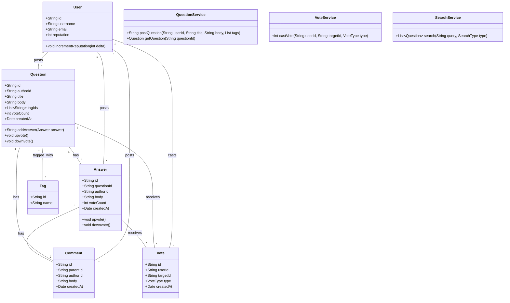

```mermaid
classDiagram
    class User {
      +String id
      +String username
      +String email
      +int reputation
      +void incrementReputation(int delta)
    }

    class Question {
      +String id
      +String authorId
      +String title
      +String body
      +List~String~ tagIds
      +int voteCount
      +Date createdAt
      +String addAnswer(Answer answer)
      +void upvote()
      +void downvote()
    }

    class Answer {
      +String id
      +String questionId
      +String authorId
      +String body
      +int voteCount
      +Date createdAt
      +void upvote()
      +void downvote()
    }

    class Comment {
      +String id
      +String parentId
      +String authorId
      +String body
      +Date createdAt
    }

    class Tag {
      +String id
      +String name
    }

    class Vote {
      +String id
      +String userId
      +String targetId
      +VoteType type
      +Date createdAt
    }

    class QuestionService {
      +String postQuestion(String userId, String title, String body, List<String> tags)
      +Question getQuestion(String questionId)
    }

    class VoteService {
      +int castVote(String userId, String targetId, VoteType type)
    }

    class SearchService {
      +List~Question~ search(String query, SearchType type)
    }

    %% Relationships
    User "1" -- "*" Question : posts
    User "1" -- "*" Answer   : posts
    User "1" -- "*" Comment  : posts
    User "1" -- "*" Vote     : casts

    Question "1" -- "*" Answer   : has
    Question "1" -- "*" Comment  : has
    Question "*" -- "*" Tag      : tagged_with
    Question "1" -- "*" Vote     : receives

    Answer   "1" -- "*" Comment  : has
    Answer   "1" -- "*" Vote     : receives
```
